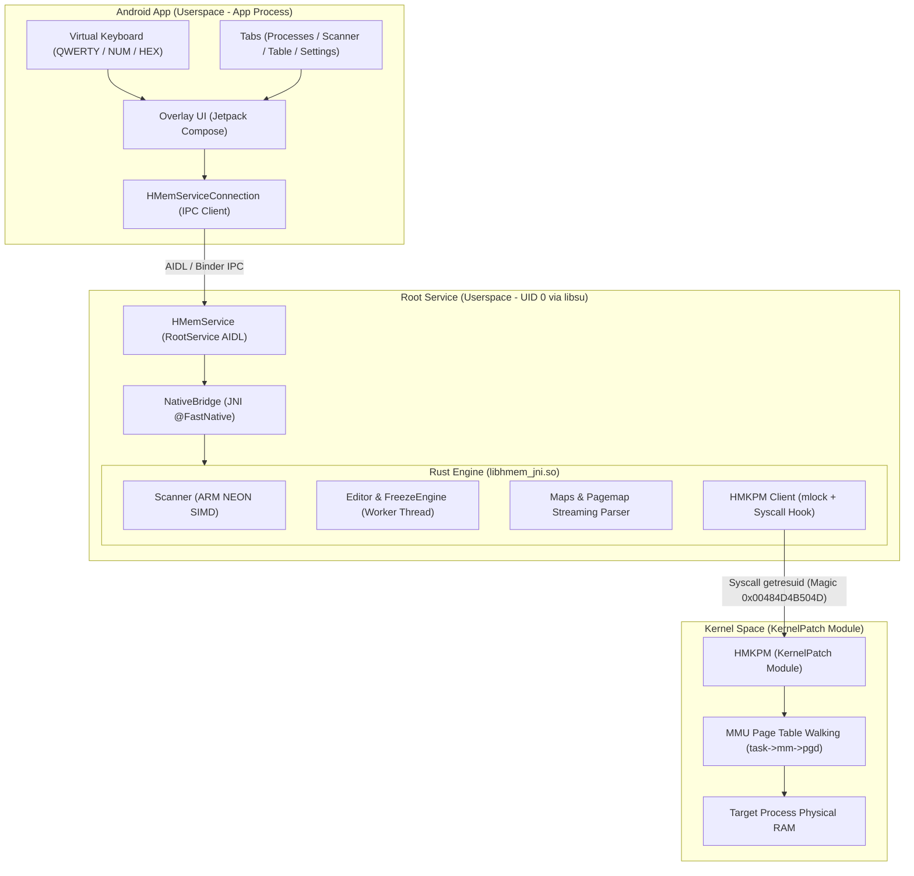

# HuntMemory (HMem) 🔍⚡

[](https://yervant7.github.io/HuntMemory/)
[](https://github.com/Yervant7/HuntMemory/actions/workflows/ci.yml)
[](LICENSE)
[-green.svg)](https://developer.android.com)
[](https://developer.arm.com)
[](https://www.rust-lang.org)
[](https://kotlinlang.org)
[](https://developer.android.com/jetpack/compose)

**HuntMemory (HMem)** is a high-performance process memory editor and scanner designed exclusively for **Android 10+ (API 29+)** on **ARM64 (`arm64-v8a` / `aarch64-linux-android`)**.

The project pairs a modern **Jetpack Compose** floating overlay UI with an ultra-fast **Rust 2024** scanning core accelerated by **ARM NEON SIMD**, interfacing directly with the Linux kernel via the **[HMKPM](https://github.com/Yervant7/HuntMemory-KPM) (KernelPatch Module)**.

---

## 📱 Target Device Requirements

To run HuntMemory on your device:

1. **Architecture**: Physical 64-bit ARM device (`arm64-v8a` / `aarch64`).
2. **Android Version**: Android 10.0+ (API level 29 or higher).
3. **Kernel Version**: Kernel Linux (4.14+).
4. **Root Environment**:
  - Magisk 26+, KernelSU, or APatch with root granted.
5. **KernelPatch & HuntMemory-KPM(HMKPM)**:
  - Device kernel patched with **[KernelPatch](https://github.com/bmax121/KernelPatch)**.
  - Or Device kernel patched with **[KPM-Manager](https://github.com/Yervant7/KPM-Manager)**.
  - **[HMKPM](https://github.com/Yervant7/HuntMemory-KPM)** loaded to enable direct MMU memory manipulation via the `SYS_GETRESUID` syscall hook.
6. **Overlay Permission**:
  - Grant **"Display over other apps"** (`SYSTEM_ALERT_WINDOW`) when prompted on the initial launch.


---

## 🏛️ System Architecture

HuntMemory isolates presentation, privileged operations, and native computation across distinct security domains:



For complete technical specifications, see the [System Architecture Documentation](docs/architecture.md).

---

## ✨ Key Features

- 🎯 **SIMD-Accelerated Memory Scanning**:
  - **ARM NEON Intrinsics**: Vectorized memory evaluation processing up to 16 bytes per cycle.
  - **Multi-Type & Auto Scan**: Search across multiple integer and floating-point types simultaneously.
  - **Range & Group Scanning**: Locate values within bounds or discover structured variables grouped closely in memory (`spec:distance`).
  - **Unknown & Differential Scans**: Track dynamic values with *Increased*, *Decreased*, *Changed*, *Unchanged*, and delta filters.

- 🔐 **Obscured & Scientific Number Support**:
  - **XOR-Keypair Decryption**: Native detection and editing for Anti-Cheat Toolkit (ACTk) obscured types (`ObscuredInt`, `ObscuredFloat`, `ObscuredDouble`, `ObscuredLong`).
  - **BigDouble / Scientific Structs**: Parse and modify scientific mantissa/exponent structures used by incremental engines (`BreakInfinity` / `Decimal`).

- 🗺️ **Comprehensive Memory Region Filtering**:
  - Automatically classifies memory mappings: `Anonymous [A]`, `C++ Alloc [CA]`, `C++ BSS [CB]`, `C++ Data [CD]`, `C++ Heap [CH]`, `Java Heap [JH]`, `Stack [S]`, `Ashmem [AS]`, and `Libraries [XA]`.
  - Pagemap residency verification and zram swap awareness.

- ✏️ **Real-Time Memory Editing & Freeze Engine**:
  - Single and batch memory writing.
  - Low-overhead native background thread maintaining locked values at configurable intervals.

- 📱 **Modern Floating Overlay UI**:
  - Fully resizable and movable overlay built with Jetpack Compose Material 3.
  - **Integrated Contextual Virtual Keyboard**: Custom QWERTY, Numeric, and Hexadecimal input without triggering system IME displacements.

---

## 📚 Technical Documentation

Deep-dive documentation for all core subsystems is available online at **[yervant7.github.io/HuntMemory](https://yervant7.github.io/HuntMemory/)** or in the [`docs/`](docs/) directory:

- 🏛️ **[System Architecture](docs/architecture.md)** — Architectural layers, lifecycle management, and IPC mechanics.
- ⚡ **[Memory Scanning Engine](docs/memory-scanning.md)** — SIMD vectorization, chunked reading pipelines, and scan modes.
- 🛡️ **[HMKPM Kernel Protocol](docs/kernel-protocol.md)** — KernelPatch module specifications, struct layouts, and syscall definitions.
- 🛠️ **[Building & Setup Guide](docs/building.md)** — Toolchain requirements, Gradle build tasks, and debugging tips.

---

## 📂 Repository Structure

```text
HuntMemory/
├── AGENTS.md                                   # Project rules and architectural guidelines
├── LICENSE                                     # GNU General Public License v3.0
├── README.md                                   # Project overview and quick start
├── docs/                                       # In-depth technical documentation
│   ├── architecture.md                         # System architecture and multi-tier design
│   ├── building.md                             # Toolchain prerequisites and build guide
│   ├── kernel-protocol.md                      # HMKPM kernel communication protocol
│   └── memory-scanning.md                      # SIMD scanning engine and data types
├── app/
│   ├── build.gradle.kts                        # Android build script & cargo-ndk automation
│   ├── src/main/
│   │   ├── AndroidManifest.xml                 # App manifest & permissions
│   │   ├── aidl/com/yervant/huntmem/
│   │   │   └── IHMemService.aidl               # RootService AIDL IPC contract
│   │   ├── hmem/                               # Rust core workspace
│   │   │   ├── Cargo.toml                      # Workspace configuration
│   │   │   └── hmem_jni/
│   │   │       ├── Cargo.toml                  # Native dependencies
│   │   │       └── src/
│   │   │           ├── lib.rs                  # JNI boundary & session manager
│   │   │           ├── kpm.rs                  # HMKPM kernel client (syscall 148)
│   │   │           ├── scanner.rs              # NEON SIMD memory scanner
│   │   │           ├── editor.rs               # Memory editor & freeze engine
│   │   │           ├── maps.rs                 # /proc/[pid]/maps parser & classifier
│   │   │           ├── pagemap.rs              # /proc/[pid]/pagemap resident page reader
│   │   │           ├── types.rs                # C-ABI structs and supported data types
│   │   │           └── logger.rs               # Android logcat bridge
│   │   └── kotlin/com/yervant/huntmem/
│   │       ├── HuntMemApp.kt                   # Application entry point
│   │       ├── backend/                        # Root service, IPC & native bridge
│   │       │   ├── NativeBridge.kt             # @FastNative JNI wrappers
│   │       │   ├── HMemService.kt              # libsu RootService implementation
│   │       │   ├── HMemServiceConnection.kt    # Service lifecycle manager
│   │       │   ├── MemoryEngine.kt             # High-level memory scan orchestrator
│   │       │   ├── MemoryScanManager.kt        # Scan session manager
│   │       │   └── ShellProcessProvider.kt     # Process discovery & enumeration
│   │       └── ui/                             # Jetpack Compose UI
│   │           ├── MainActivity.kt             # Setup & permission verification
│   │           ├── OverlayService.kt           # Floating overlay lifecycle service
│   │           ├── OverlayUI.kt                # Main Compose overlay container
│   │           ├── keyboard/                   # Integrated virtual keyboard
│   │           ├── overlay/tabs/               # UI tabs (Process, Scan, Table, Settings)
│   │           └── theme/                      # Material 3 styling & typography
```

---

## 🛠️ Quick Build Guide

### Prerequisites
- **Android SDK**: `compileSdk = 37`, `minSdk = 29`, NDK `29.0.14206865`
- **JDK**: Java 21 LTS
- **Rust**: Rust 2024 Edition (`rustup target add aarch64-linux-android`)
- **cargo-ndk**: `cargo install cargo-ndk`

### Compiling the APK
Gradle automatically builds the Rust native shared library (`libhmem_jni.so`) during the build lifecycle:

```bash
# Debug build
.\gradlew assembleDebug

# Release build
.\gradlew assembleRelease
```

For detailed instructions, refer to the [Building Guide](docs/building.md).

---

## 📜 License

HuntMemory is licensed under the **GNU General Public License v3.0 (GPLv3)**. See the [LICENSE](LICENSE) file for details.
