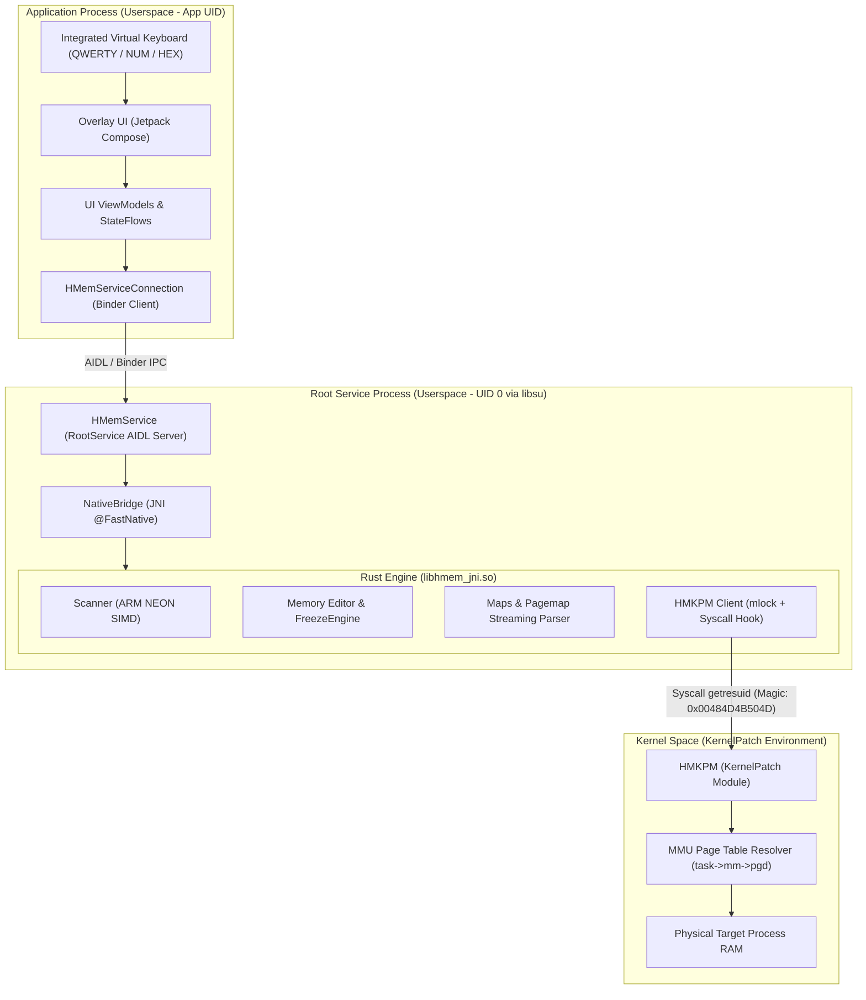

# HuntMemory System Architecture

HuntMemory (HMem) is engineered as a multi-tier, high-performance process memory editor and scanner for **Android 10+ (API 29+)** running exclusively on **ARM64 (`arm64-v8a` / `aarch64-linux-android`)**.

---

## 🏛️ High-Level Overview

The system isolates execution across four privilege and execution domains:

---

## 📱 1. Presentation Layer (App Process)

The user-facing presentation layer runs in a standard Android app process and is built entirely using **Jetpack Compose**.

### Key Components

- **`OverlayService`**:
  - Implements an Android `LifecycleService` providing lifecycle support (`SavedStateRegistryOwner`, `ViewModelStoreOwner`) to Compose floating windows.
  - Attaches views to the system `WindowManager` using `WindowManager.LayoutParams.TYPE_APPLICATION_OVERLAY`.
  - Supports dynamic resizing, repositioning, and collapse into a floating bubble overlay.

- **Integrated Virtual Keyboard (`VirtualKeyboard`)**:
  - Eliminates reliance on the system Input Method Editor (IME), preventing window re-layouts or overlay displacements over target games/applications.
  - Dynamically renders contextual keyboard layouts: **QWERTY**, **Numeric / Decimal**, and **Hexadecimal**.

- **Asynchronous State Management**:
  - UI state is managed through `StateFlow` and Kotlin Coroutines on `Dispatchers.IO` / `Dispatchers.Default`, ensuring the main UI thread never blocks during intensive scanning or IPC calls.

---

## ⚡ 2. Privileged IPC Layer (Root Process)

To bypass Android userspace SELinux restrictions and access low-level OS interfaces (`/proc/[pid]/maps`, `pagemap`, kernel syscalls), HuntMemory spawns a dedicated root daemon.

### Key Components

- **`libsu` RootService**:
  - Utilizes `top.canyie.pine` / `com.github.topjohnwu.libsu` to spawn an isolated root daemon executing with `UID 0`.
  - Communicates with the application process across process boundaries using standard Android Binder and AIDL (`IHMemService.aidl`).

- **`HMemService`**:
  - Implements the server-side AIDL interface.
  - Loads the compiled native binary (`libhmem_jni.so`) in the root context.
  - Manages session IDs, process attachment state, and life-cycle events.

---

## 🦀 3. Native Engine Layer (Rust 2024 / JNI)

The computational engine is implemented in **Rust (Edition 2024)** and compiled into `libhmem_jni.so`.

### Key Components

- **Zero-Panic JNI Boundary**:
  - Every exported JNI function wraps execution inside `std::panic::catch_unwind`.
  - Errors are safely converted into typed error codes or structured JSON payloads, preventing JVM/ART crashes.

- **`@FastNative` Optimization**:
  - Native functions avoid full JNI transition overhead when executing lightweight memory operations.

- **Memory Map Streaming Parser (`maps.rs` & `pagemap.rs`)**:
  - Parses `/proc/[pid]/maps` using reusable heap buffers and zero-copy string slicing.
  - Cross-references virtual memory ranges with `/proc/[pid]/pagemap` using batched `pread` to discard non-resident pages before scanning.

- **Freeze Engine (`editor.rs`)**:
  - Runs a dedicated background worker thread synchronized via `Arc<(Mutex<FreezeState>, Condvar)>`.
  - Re-applies desired memory values to registered addresses at configurable intervals (default: 100ms) with microsecond precision.

---

## 🛡️ 4. KernelPatch Module Layer (HMKPM)

HuntMemory interacts directly with physical memory through **HMKPM**, a specialized **KernelPatch Module**.

### Key Characteristics

- **Dedicated Syscall Hooking**:
  - Hooks the `SYS_GETRESUID` syscall (Syscall ID 148 on aarch64) using a proprietary 64-bit magic constant (`0x0048_4D4B_504D`).

- **Direct MMU Translation (`pgd`)**:
  - Traverses the target process page tables directly (`task->mm->pgd`).
  - Resolves virtual-to-physical memory mappings.

- **Userspace Memory Locking (`mlock`)**:
  - Userspace transfer buffers are pinned with `mlock` during large batch operations, guaranteeing that the Linux kernel paging daemon does not trigger unexpected page faults while accessing memory buffers.
