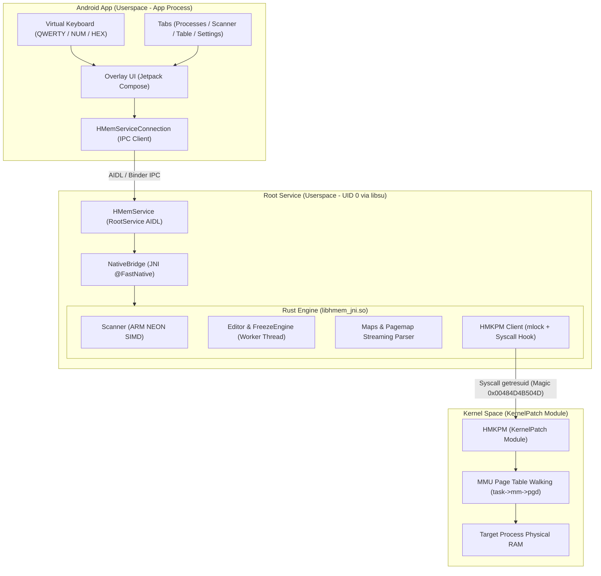

# HuntMemory (HMem) 🔍⚡

[](license.md)
[-green.svg)](https://developer.android.com)
[](https://developer.arm.com)
[](https://www.rust-lang.org)
[](https://kotlinlang.org)
[](https://developer.android.com/jetpack/compose)

**HuntMemory (HMem)** is a high-performance process memory editor and scanner designed exclusively for **Android 11+ (API 30+)** on **ARM64 (`arm64-v8a` / `aarch64-linux-android`)**.

The project pairs a modern **Jetpack Compose** floating overlay UI with an ultra-fast **Rust 2024** scanning core accelerated by **ARM NEON SIMD**, interfacing directly with the Linux kernel via the **[HMKPM](https://github.com/Yervant7/HuntMemory-KPM) (KernelPatch Module)**.

---

## 🧭 Documentation Navigation

<div class="grid cards" markdown>

-   :material-layers-triple:{ .lg .middle } __[System Architecture](architecture.md)__

    ---

    Explore the multi-tier isolation model, Android `OverlayService`, `libsu` RootService AIDL IPC, and the Rust JNI engine.

    [:octicons-arrow-right-24: Read Architecture](architecture.md)

-   :material-flash-outline:{ .lg .middle } __[Memory Scanning Engine](memory-scanning.md)__

    ---

    Understand the ARM64 NEON SIMD vectorization, 4MB → 64KB subdivision reader, ACTk obscured types, and memory region filtering.

    [:octicons-arrow-right-24: Read Scanning Guide](memory-scanning.md)

-   :material-shield-key-outline:{ .lg .middle } __[HMKPM Kernel Protocol](kernel-protocol.md)__

    ---

    Deep-dive into the `SYS_GETRESUID` syscall hook (148), C-ABI struct layouts, batch payload memory alignments, and MMU `pgd` resolution.

    [:octicons-arrow-right-24: Read Protocol Spec](kernel-protocol.md)

-   :material-hammer-wrench:{ .lg .middle } __[Building & Setup](building.md)__

    ---

    Prerequisites, Android NDK 29+ setup, Rust 2024 `cargo-ndk` compilation, Gradle automation, and troubleshooting.

    [:octicons-arrow-right-24: Read Build Guide](building.md)

</div>

---

## 📱 Target Device Requirements

To run HuntMemory on your device:

1. **Architecture**: Physical 64-bit ARM device (`arm64-v8a` / `aarch64`).
2. **Android Version**: Android 11.0+ (API level 30 or higher).
3. **Kernel Version**: Kernel Linux 4.14+.
4. **Root Environment**: Magisk 26+, KernelSU, or APatch with root granted.
5. **KernelPatch & HuntMemory-KPM (HMKPM)**:
    - Device kernel patched with **[KernelPatch](https://github.com/bmax121/KernelPatch)** or **[KPM-Manager](https://github.com/Yervant7/KPM-Manager)**.
    - **[HMKPM](https://github.com/Yervant7/HuntMemory-KPM)** loaded to enable direct MMU memory manipulation via the `SYS_GETRESUID` syscall hook.
6. **Overlay Permission**:
    - Grant **"Display over other apps"** (`SYSTEM_ALERT_WINDOW`) when prompted on the initial launch.

---

## 🏛️ System Architecture Preview

HuntMemory isolates presentation, privileged operations, and native computation across distinct security domains:



---

## ✨ Key Features

- 🎯 **SIMD-Accelerated Memory Scanning**:
    - **ARM NEON Intrinsics**: Vectorized memory evaluation processing up to 16 bytes per cycle.
    - **Multi-Type & Auto Scan**: Search across multiple integer and floating-point types simultaneously.
    - **Range & Group Scanning**: Locate values within bounds or discover structured variables grouped closely in memory (`spec:distance`).
    - **Unknown & Differential Scans**: Track dynamic values with *Increased*, *Decreased*, *Changed*, *Unchanged*, and delta filters.

- 🔐 **Obscured & Scientific Number Support**:
    - **XOR-Keypair Decryption**: Native detection and editing for Anti-Cheat Toolkit (ACTk) obscured types (`ObscuredInt`, `ObscuredFloat`, `ObscuredDouble`, `ObscuredLong`).
    - **BigDouble / Scientific Structs**: Parse and modify scientific mantissa/exponent structures used by incremental engines (`BreakInfinity` / `Decimal`).

- 🗺️ **Comprehensive Memory Region Filtering**:
    - Automatically classifies memory mappings: `Anonymous [A]`, `C++ Alloc [CA]`, `C++ BSS [CB]`, `C++ Data [CD]`, `C++ Heap [CH]`, `Java Heap [JH]`, `Stack [S]`, `Ashmem [AS]`, and `Libraries [XA]`.
    - Pagemap residency verification and zram swap awareness.

- ✏️ **Real-Time Memory Editing & Freeze Engine**:
    - Single and batch memory writing.
    - Low-overhead native background thread maintaining locked values at configurable intervals.

- 📱 **Modern Floating Overlay UI**:
    - Fully resizable and movable overlay built with Jetpack Compose Material 3.
    - **Integrated Contextual Virtual Keyboard**: Custom QWERTY, Numeric, and Hexadecimal input without triggering system IME displacements.

---

## 🛠️ Quick Build

```bash
# Clone repository
git clone https://github.com/Yervant7/HuntMemory.git
cd HuntMemory

# Add ARM64 Rust target & cargo-ndk
rustup target add aarch64-linux-android
cargo install cargo-ndk

# Compile Debug APK (Rust native library compiles automatically)
.\gradlew assembleDebug
```

For complete compilation guidelines, refer to the [Building Guide](building.md).
