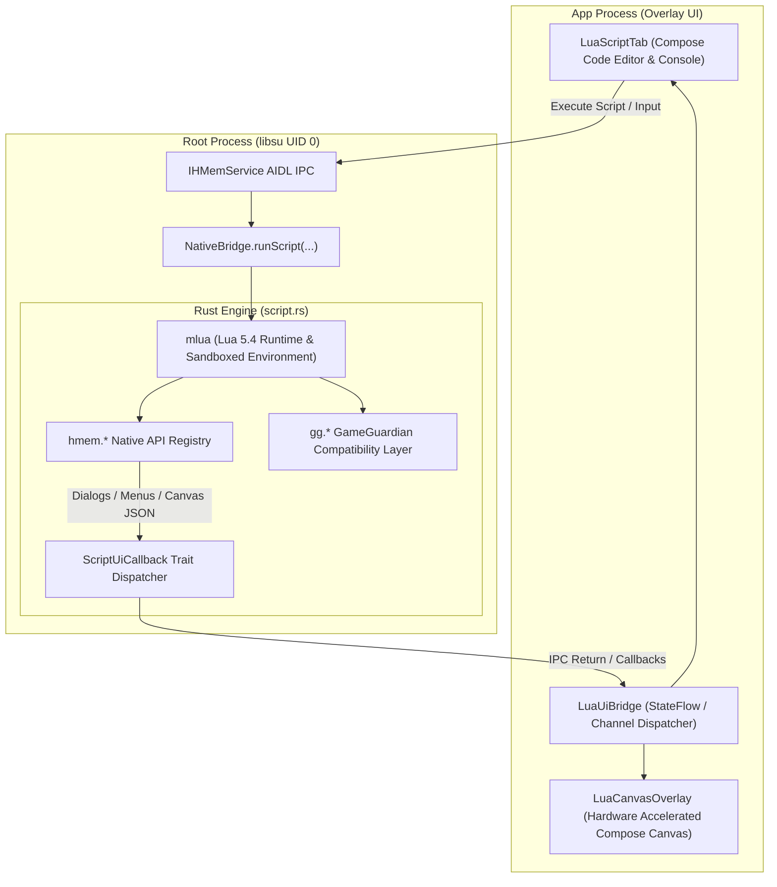
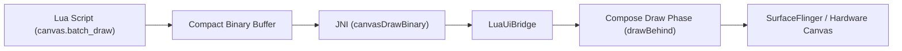

# Lua Scripting Engine & API Reference

HuntMemory integrates a high-performance **Lua 5.4 scripting engine** (powered by `mlua` in Rust) allowing automation of memory scans, real-time memory manipulation, pointer resolution, dynamic Jetpack Compose overlay menus, and on-screen **Canvas ESP / HUD rendering**.

Additionally, HuntMemory provides an out-of-the-box **GameGuardian (`gg.*`) API compatibility layer**, enabling existing GameGuardian Lua scripts to run directly on ARM64 Android with direct MMU kernel speed.

---

## 🏛️ 1. Scripting Engine Architecture



### Execution Characteristics
- **Sandboxed Execution**: Scripts run in an isolated Lua 5.4 instance per execution request.
- **Console Capture**: `print(...)` statements are redirected to both the in-app interactive console and Android Logcat (`[LuaScript]`).
- **Asynchronous UI Callbacks**: Calls to `hmem.alert`, `hmem.prompt`, `hmem.choice`, and `hmem.create_menu` safely pause execution and wait for user response without blocking the Android UI thread.

---

## 🔍 2. `hmem.*` Native API Reference

### Process Control & Utilities

| Function | Parameters | Returns | Description |
| :--- | :--- | :--- | :--- |
| `hmem.get_pid()` | *none* | `number` | Returns current attached process PID. |
| `hmem.set_pid(pid)` | `pid: number` | `nil` | Changes target PID for subsequent operations. |
| `hmem.log(message)` | `msg: string` | `nil` | Outputs a string to the in-app console & logcat. |
| `hmem.sleep(millis)` | `ms: number` | `nil` | Suspends script execution for specified milliseconds. |

---

### Direct Primitive Memory Access

Read and write memory directly using HMKPM direct kernel page table access:

```lua
-- Primitive Read Functions
local byte_val   = hmem.read_byte(0x7F001234)    -- i8
local short_val  = hmem.read_short(0x7F001234)   -- i16
local int_val    = hmem.read_int(0x7F001234)     -- i32
local long_val   = hmem.read_long(0x7F001234)    -- i64
local float_val  = hmem.read_float(0x7F001234)   -- f32
local double_val = hmem.read_double(0x7F001234)  -- f64
local bytes_tbl  = hmem.read_bytes(0x7F001234, 16) -- table of bytes

-- Primitive Write Functions
hmem.write_byte(0x7F001234, 255)
hmem.write_short(0x7F001234, 32000)
hmem.write_int(0x7F001234, 999999)
hmem.write_long(0x7F001234, 1234567890123)
hmem.write_float(0x7F001234, 100.5)
hmem.write_double(0x7F001234, 99999.999)
hmem.write_bytes(0x7F001234, { 0x90, 0x90, 0x00, 0x00 }) -- or hex string "90 90 00 00"

-- Generic Read/Write
local val_str = hmem.read(0x7F001234, "int")     -- Returns string or nil
hmem.write(0x7F001234, "500", "int")

-- Atomic Batch Write
local count = hmem.batch_write({
    { address = 0x7F001000, value = "100", type = "int" },
    { address = 0x7F002000, value = "99.5", type = "float" }
})
```

---

### SIMD-Accelerated Memory Scanning

```lua
-- Search Exact Values
local res = hmem.search("session_1", "1000", "int", "=")
print("Found " .. res.count .. " matches")

-- Range Search
local res_range = hmem.search_range("session_1", "50", "100", "float")

-- Group Search (Homogeneous & Heterogeneous)
local res_group = hmem.search_group("session_1", "100;200;300:16", "int")

-- Anti-Cheat Obscured Search
local res_obs = hmem.search_obscured("session_1", "999", "obscured_int")

-- BigDouble Scientific Search
local res_big = hmem.search_big_double("session_1", "1.5e12")

-- Refine Existing Results
local refined = hmem.refine("session_1", "1200", "=")
local refined_range = hmem.refine_range("session_1", "1100", "1300")

-- Fetch Results & Clear
local results = hmem.get_results("session_1", 50)
for i, item in ipairs(results.matches) do
    print(string.format("[%d] 0x%X = %s (%s)", i, item.address, item.value, item.value_type))
end

hmem.clear_session("session_1")
```

---

### Pointer Resolution & Multi-Level Offsets

```lua
-- Resolve module base address
local libil2cpp = hmem.get_module_base("libil2cpp.so")
print(string.format("libil2cpp.so Base: 0x%X", libil2cpp))

-- Resolve pointer chain: [[libil2cpp + 0x1A0] + 0x28] + 0x10
local target_addr = hmem.resolve_pointer(libil2cpp + 0x1A0, { 0x28, 0x10 })
if target_addr then
    print(string.format("Target Address: 0x%X", target_addr))
    local current_val = hmem.read_pointer(libil2cpp + 0x1A0, { 0x28, 0x10 }, "int")
    hmem.write_pointer(libil2cpp + 0x1A0, { 0x28, 0x10 }, "9999", "int")
end
```

---

### Obscured & XOR Keypair Helpers

```lua
-- Read XOR Value with Known Key
local val = hmem.read_xor(0x7F001000, 0x12345678, "int")
hmem.write_xor(0x7F001000, "5000", 0x12345678, "int")

-- Encode / Decode Anti-Cheat Toolkit Obscured Types
local encoded = hmem.encode_obscured("12345", "obscured_int", 0xAABBCCDD)
print("Key: " .. encoded.key .. ", Hidden: " .. encoded.hidden)

local decoded = hmem.decode_obscured(encoded.key, encoded.hidden, "obscured_int")
print("Decoded: " .. decoded)
```

---

## 🎨 3. Dynamic Compose Overlay UI & Dialogs

Scripts can render interactive dialogs, toasts, prompt inputs, and dynamic menus directly within HuntMemory's Material 3 overlay:

### Interactive Dialogs

```lua
-- Toast Notification
hmem.toast("Scan completed successfully!")

-- Alert Dialog (Pauses execution until dismissed)
hmem.alert("Memory patch applied!", "Cheat Engine")

-- Text / Numeric Prompt
local user_input = hmem.prompt("Enter new gold amount:", "999999", "number")

-- Single Choice Dialog
local choice_idx = hmem.choice("Select Character Class:", { "Warrior", "Mage", "Archer" })
if choice_idx then
    print("User selected index: " .. choice_idx)
end

-- Multi-Choice Dialog
local selected = hmem.multi_choice("Enable Features:", { "Godmode", "Infinite Ammo", "Speedhack" }, { true, false, true })
if selected then
    print("Godmode: " .. tostring(selected[1]))
    print("Infinite Ammo: " .. tostring(selected[2]))
    print("Speedhack: " .. tostring(selected[3]))
end
```

### Dynamic Floating Overlay Menus

Create fully customizable floating menus in the Compose overlay tab:

```lua
hmem.create_menu("God Mode Hub", {
    { type = "header", label = "PLAYER MODIFIERS" },
    { type = "button", id = "btn_heal", label = "⚡ Refill Health (100%)", color = "#4CAF50" },
    { type = "toggle", id = "tog_freeze", label = "❄️ Freeze Health", checked = true },
    { type = "button", id = "btn_coins", label = "💰 Add 1,000,000 Gold", color = "#FFC107" },
    { type = "divider" },
    { type = "button", id = "btn_exit", label = "❌ Close Menu", color = "#F44336" }
})

-- Clear dynamic menu
-- hmem.clear_menu()
```

---

## 🖥️ 4. Real-Time Canvas Overlay (ESP / HUD)

HuntMemory provides a high-performance hardware-accelerated **Canvas Overlay** subsystem (`hmem.canvas` and global `canvas`) that renders directly over running 3D games or apps without window flickering.



### Canvas API Reference

| Function | Parameters | Description |
| :--- | :--- | :--- |
| `canvas.clear()` | *none* | Clears all active canvas drawing commands. |
| `canvas.set_visible(bool)` | `visible: boolean` | Toggles canvas visibility. |
| `canvas.show()` / `canvas.hide()` | *none* | Shows or hides the canvas overlay. |
| `canvas.is_visible()` | *none* | Returns `true` if canvas is currently visible. |
| `canvas.get_screen_size()` | *none* | Returns `{ width = w, height = h }` in pixels. |
| `canvas.get_width()` | *none* | Returns screen width in pixels. |
| `canvas.get_height()` | *none* | Returns screen height in pixels. |
| `canvas.draw_text(...)` | `text, x, y, [size], [color], [align]` | Draws text on screen. `align` can be `"left"`, `"center"`, or `"right"`. |
| `canvas.draw_line(...)` | `x1, y1, x2, y2, [stroke], [color]` | Draws a 2D line. |
| `canvas.draw_rect(...)` | `x, y, w, h, [stroke], [color], [filled]` | Draws an outlined or filled bounding rectangle. |
| `canvas.draw_circle(...)` | `cx, cy, radius, [stroke], [color], [filled]` | Draws an outlined or filled circle. |
| `canvas.batch_draw(...)` | `commands_table` | Sends multiple drawing commands in a single atomic frame. |

### Color Formats
Colors accept:
- Hex strings: `"#FF0000"`, `"#80FF0000"` (with alpha channel)
- Integers: `0xFFFF0000`
- Tables: `{ r = 255, g = 0, b = 0, a = 255 }` or `{ 255, 0, 0, 255 }`

---

## 🎮 5. GameGuardian (`gg.*`) Compatibility Layer

HuntMemory includes seamless emulation of the GameGuardian scripting standard:

### Supported Constants

```lua
-- Types
gg.TYPE_BYTE    -- 1
gg.TYPE_WORD    -- 2 (Short / Int16)
gg.TYPE_DWORD   -- 4 (Int32)
gg.TYPE_QWORD   -- 32 (Int64)
gg.TYPE_FLOAT   -- 16 (Float32)
gg.TYPE_DOUBLE  -- 64 (Float64)
gg.TYPE_AUTO    -- 127

-- Regions
gg.REGION_ALL        -- 0xFFFFFFFF
gg.REGION_ANONYMOUS  -- 32
gg.REGION_C_ALLOC    -- 4
gg.REGION_C_BSS      -- 8
gg.REGION_C_DATA     -- 16
gg.REGION_C_HEAP     -- 1
gg.REGION_JAVA_HEAP  -- 2
gg.REGION_STACK      -- 64
gg.REGION_ASHMEM     -- 524288
gg.REGION_CODE_APP   -- 16384
gg.REGION_CODE_SYS   -- 32768
```

### GameGuardian Workflow Example

```lua
gg.alert("Starting GameGuardian compatible cheat script...")

-- Configure Search Memory Regions
gg.setRanges(gg.REGION_ANONYMOUS | gg.REGION_C_ALLOC)

-- Initial Search
gg.searchNumber("100", gg.TYPE_DWORD)

-- Refinement
gg.sleep(500)
gg.refineNumber("100", gg.TYPE_DWORD)

local count = gg.getResultsCount()
if count > 0 then
    local results = gg.getResults(10)
    gg.toast("Found " .. count .. " matches. Editing all to 99999...")
    
    -- Edit all results in batch
    gg.editAll("99999", gg.TYPE_DWORD)
else
    gg.alert("No matching values found.")
end
```

---

## 💡 6. Practical Script Examples

### Example 1: Full Radar / ESP Overlay Loop

```lua
local screen = canvas.get_screen_size()
local cx = screen.width / 2
local cy = screen.height / 2

canvas.show()
canvas.clear()

-- Draw crosshair and radar HUD
canvas.batch_draw({
    -- Center Crosshair
    { type = "line", x1 = cx - 20, y1 = cy, x2 = cx + 20, y2 = cy, stroke = 2.0, color = "#00FF00" },
    { type = "line", x1 = cx, y1 = cy - 20, x2 = cx, y2 = cy + 20, stroke = 2.0, color = "#00FF00" },
    
    -- Radar Circle
    { type = "circle", cx = 150, cy = 150, radius = 100, stroke = 2.0, color = "#40FFFFFF", filled = false },
    { type = "circle", cx = 150, cy = 150, radius = 4, stroke = 0, color = "#00FF00", filled = true },
    
    -- Player Entity Box Example
    { type = "rect", x = cx - 50, y = cy - 100, width = 100, height = 200, stroke = 3.0, color = "#FF0000", filled = false },
    { type = "text", text = "Enemy [100m]", x = cx, y = cy - 110, size = 16.0, color = "#FFFF00", align = "center" }
})
```

### Example 2: Multi-Level Pointer Scanner & Freeze

```lua
local base = hmem.get_module_base("libunity.so")
if not base or base == 0 then
    hmem.alert("libunity.so not found in process maps!", "Error")
    return
end

local player_addr = hmem.resolve_pointer(base + 0x4D2F00, { 0x58, 0x10, 0x24 })
if player_addr and player_addr ~= 0 then
    hmem.toast(string.format("Player resolved at: 0x%X", player_addr))
    
    -- Set max health
    hmem.write_int(player_addr, 9999)
    hmem.alert("Health set to 9999!", "Success")
else
    hmem.toast("Failed to resolve pointer chain.")
end
```
