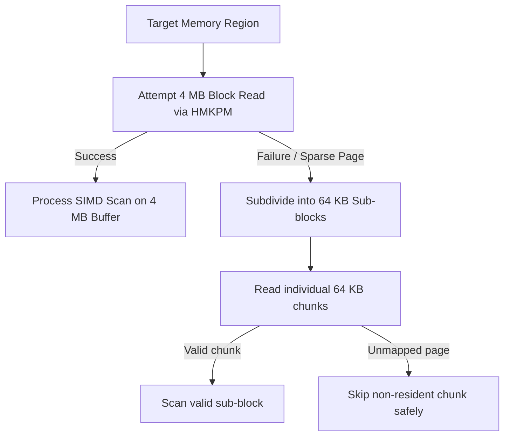

# Memory Scanning & Search Engine

HuntMemory's core memory scanning engine is written in **Rust Edition 2024** and optimized with **ARM64 NEON SIMD intrinsics**, providing maximum throughput when filtering gigabytes of process memory.

---

## ⚡ 1. ARM64 NEON SIMD Vectorization

During memory scanning, HuntMemory compares blocks of memory using 128-bit vector registers (`v0`-`v31`) via `std::arch::aarch64`.

### Vectorized Scan Operations

- **8-bit Integers (`i8` / `u8`)**: Processes **16 elements per cycle** using `vld1q_s8` and `vceqq_s8` / `vcgtq_s8` / `vcltq_s8`.
- **16-bit Integers (`i16` / `u16`)**: Processes **8 elements per cycle** using `vld1q_s16`.
- **32-bit Integers (`i32` / `u32`)**: Processes **4 elements per cycle** using `vld1q_s32`.
- **64-bit Integers (`i64` / `u64`)**: Processes **2 elements per cycle** using `vld1q_s64`.
- **32-bit Floats (`f32`)**: Vectorized comparison using `vld1q_f32` and `vceqq_f32` with IEEE 754 epsilon handling.
- **64-bit Doubles (`f64`)**: Vectorized equality checks with `vld1q_f64` and `vceqq_f64`.

Mask extraction is performed efficiently using bitwise reduction (`vmaxvq_u8` / `vaddv_u8`) to quickly skip unmatching SIMD lanes without scalar branch penalties.

---

## 🧩 2. Robust Chunked Memory Reader

Process memory on Android often contains sparse, unmapped, or guard pages within mapped virtual ranges.

### The 4MB → 64KB Subdivision Pipeline

1. Memory regions are read in **4 MB chunks** to minimize kernel syscall transitions.
2. If a 4 MB block read fails due to non-resident or guard pages, the engine automatically falls back to **64 KB sub-chunks**, extracting all accessible data while ignoring faulting pages.

---

## 🗺️ 3. Memory Region Classification & Filtering

Memory regions are parsed from `/proc/[pid]/maps` and matched against physical presence in `/proc/[pid]/pagemap`.

### Memory Region Types

| Code | Region Type | Path / Allocation Pattern |
| :--- | :--- | :--- |
| **`[A]`** | Anonymous | `[anon:*]`, unlabelled private mappings |
| **`[CA]`** | C++ Alloc | `[anon:libc_malloc]`, `[anon:scudo:*]`, `[anon:jemalloc]`, `[anon:GWP-ASan]` |
| **`[CB]`** | C++ BSS | `[anon:.bss]`, `[anon:bss]` |
| **`[CD]`** | C++ Data | `/data/app/*`, `/data/data/*`, `/data/user/*` |
| **`[CH]`** | C++ Heap | `[heap]` |
| **`[JH]`** | Java Heap | `/dev/ashmem/dalvik*`, `[anon:dalvik-*]`, `[anon:art_*]`, `[anon:main space]`, `[anon:region space]` |
| **`[S]`** | Stack | `[stack]`, `[stack:*]` |
| **`[AS]`** | Ashmem | `/dev/ashmem*`, `[anon:ashmem]` |
| **`[XA]`** | Libraries / Code | `*.so`, `*.apk`, `*.dex`, `*.odex`, `*.oat`, `*.vdex`, `*.art`, `*.jar` |
| **`[NL]`** | Native Libs | `*.so` native shared libraries |
| **`[F]`** | Files | Mapped filesystem files (`/data/*`, `/system/*`, etc.) |
| **`[CUSTOM]`** | Custom Filter | Regex or substring match against path names |

### Contiguous Region Consolidation (`merged_count`)
Contiguous adjacent memory mappings sharing identical permissions, paths, and continuous file offsets are automatically consolidated into single unified entries with a `merged_count` indicator, significantly reducing memory table clutter and kernel scan dispatch overhead.

### Pagemap Residency & Memory Safety Rules
- **Non-File Regions**: Verified against `/proc/[pid]/pagemap` using `PM_PRESENT` (bit 63) to ensure memory is resident in physical RAM before reading.
- **Data & Libs (`CD`, `XA`)**: Supports both `PM_PRESENT` and `PM_SWAP` (bit 62) to handle Android zram-compressed pages.
- **Memory Write Verification**: All memory writing operations (`write_value`, `write_obscured`, `write_big_double`, `batch_write`, `write_xor_value`, Lua scripts, and `FreezeEngine`) validate `PM_PRESENT` for starting and ending boundary pages before issuing kernel syscalls.
- **Chunk Boundary Overlap**: Scans across 4 MB chunks use an overlap rewind window (`max_step - 1`) with deduplication to guarantee multi-byte values crossing chunk boundaries are never split or missed.

---

## 🎯 4. Scanning Modes & Capabilities

### 1. Exact Value Scan
Finds variables matching a specific value with exact type representation:
- Supported types: `Byte`, `Short`, `Int`, `Long`, `Float`, `Double`, `Float16`.
- Supports hexadecimal input formats (`0x100`, `-0x20`).

### 2. Multi-Type / Auto Scan
Specifying `Auto` or combining types (e.g. `int, float, double`) searches all selected types simultaneously across memory in a single pass.

### 3. Range Scan
Finds values within a specified minimum and maximum boundary:
`minValue <= X <= maxValue`

### 4. Group Scan (Heterogeneous & Homogeneous Structs)
Locates grouped variables and struct fields situated close to each other in memory within a specified byte distance.
- **Homogeneous format**: `100;200;300:16` (finds 100, 200, and 300 within 16 bytes distance).
- **Heterogeneous format**: `f64:100.5; i64:5000 : 32` (finds typed variables with distinct sizes).

### 5. Array of Bytes (AoB) & Signature Scanning
Searches for byte sequences with wildcard mask support:
- **Pattern Format**: Space-separated hex bytes with `?`, `??`, or `*` wildcards (e.g. `00 20 40 ? ? 90 00`).
- **Bitwise Evaluation**: Matches exact bytes through `(byte & mask) == target`, ensuring wildcard bytes (`mask = 0x00`) match any byte in RAM.
- **Chunk Window Overlap**: When scanning across multi-megabyte memory chunks, an overlap rewind window of `pattern_length - 1` prevents signatures spanning block boundaries from being split or omitted.

### 6. Unknown & Relative Scans
Supports initial scans without known values, followed by differential refinement passes:
- **`▲ Increased`**: Value has increased compared to the previous pass.
- **`▼ Decreased`**: Value has decreased compared to the previous pass.
- **`~ Changed`**: Value has changed from the previous scan.
- **`= Unchanged`**: Value remains identical.
- **`+ Increased By (X)`**: Value has increased by exactly `X`.
- **`- Decreased By (X)`**: Value has decreased by exactly `X`.

---

## 🔬 5. Half-Precision Float (`Float16`) Processing

HuntMemory provides full native support for **IEEE 754 16-bit half-precision floating-point numbers (`Float16` / `f16`)**:
- **Layout**: 1 sign bit, 5 exponent bits, and 10 fraction bits.
- **Subnormal & Denormal Handling**: Normalized using branchless leading-zero computation (`CLZ` on ARM64) to maintain precision without scalar exceptions.
- **Conversion Pipelines**: Direct bitwise conversion functions (`f16_to_f32` and `f32_to_f16`) allow seamless filtering, range evaluation, and memory editing of mobile shaders and compact float arrays.

---

## ⚡ 6. High-Throughput Binary Serialization

To eliminate JSON serialization and garbage collection pauses across the JNI bridge when dealing with millions of scan matches:
- **`encode_regions_binary`**: Serializes `/proc/[pid]/maps` region structures into a dense binary byte array with 8-byte aligned addresses and 4-byte ASCII permissions.
- **`encode_matches_page_binary`**: Streams paginated scan results to the Android UI using compact fixed-width structures (8 bytes address, 8 bytes start/end, 1 byte type code, 4 bytes permissions, length-prefixed value strings).

---

## 🔐 7. Obscured Types & Scientific Notations

### Obscured XOR Keypairs (Anti-Cheat Toolkit / ACTk)
Many games store sensitive variables (e.g., gold, health) as XOR-encrypted pairs:
$$\text{hiddenValue} = \text{targetValue} \oplus \text{cryptoKey}$$
- **`ObscuredInt` / `ObscuredFloat`** (8 bytes: 4-byte key + 4-byte encrypted value).
- **`ObscuredDouble` / `ObscuredLong`** (16 bytes: 8-byte key + 8-byte encrypted value).

HuntMemory detects, decodes, and writes obscured types directly, automatically handling random key rotation or key preservation.

### BigDouble Scientific Structs (BreakInfinity / Decimal)
Idle and incremental games frequently utilize large number libraries represented as mantissa and exponent structs:
$$\text{Value} = \text{mantissa} \times 10^{\text{exponent}}$$
- **16-byte format**: `{ mantissa: f64, exponent: i64 }`
- **12-byte format**: `{ mantissa: f64, exponent: i32 }`

Format parsing supports scientific notation directly (e.g., `1.5e12` or `1.5,12`).

---

## ❄️ 8. Memory Freeze Engine

- **Native Background Worker**: Managed via a dedicated thread in `editor.rs` synchronized with `Arc<(Mutex<FreezeState>, Condvar)>`.
- **Atomic Registration**: Addresses are registered with their target value and partitioned by `(pid, address)`.
- **Physical Page Validation**: Verifies `PM_PRESENT` on each target page prior to writing.
- **Configurable Tick Rate**: Operates at configurable tick intervals (default: **100ms**) using batched kernel writes to minimize CPU wakeups.
